# Korido Candidate Flow Mermaid

This file is the visual contract for candidate-critical Korido flows. It maps
user paths, FSM events, API calls, backend decisions, provider fallbacks, and
candidate gates. Keep implementation aligned with these diagrams before
promoting `develop` to `staging`.

## 1. App Startup, Version, Security, And Default Entry

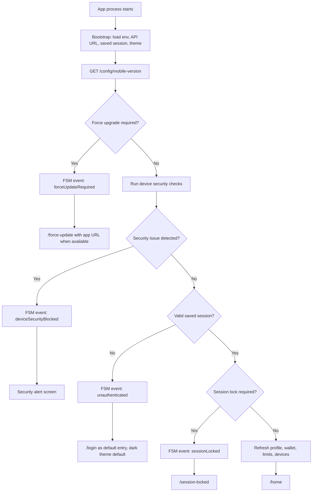

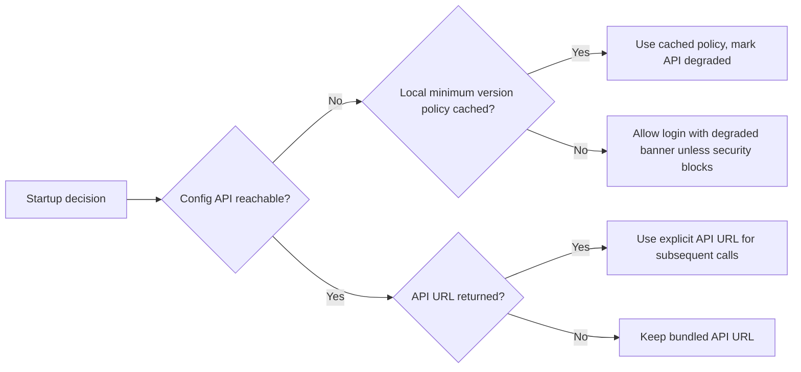

## 2. Login And OTP

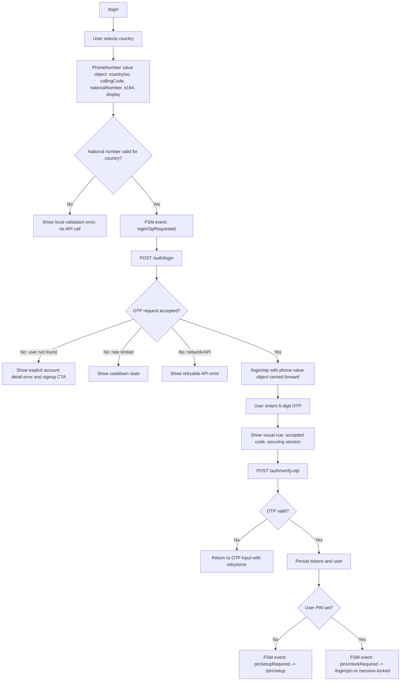

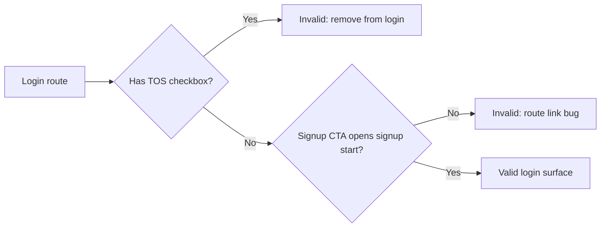

## 3. Signup, Consent, And Onboarding

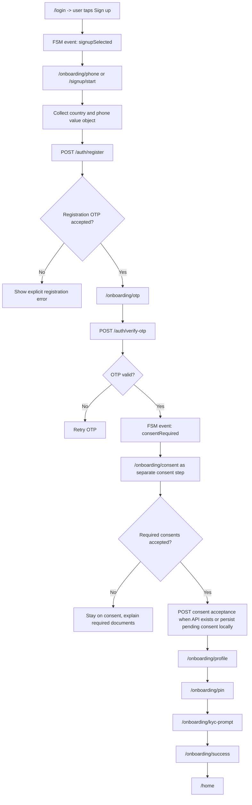

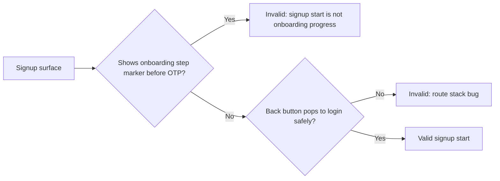

## 4. PIN Unlock, Setup, Change, And Recovery

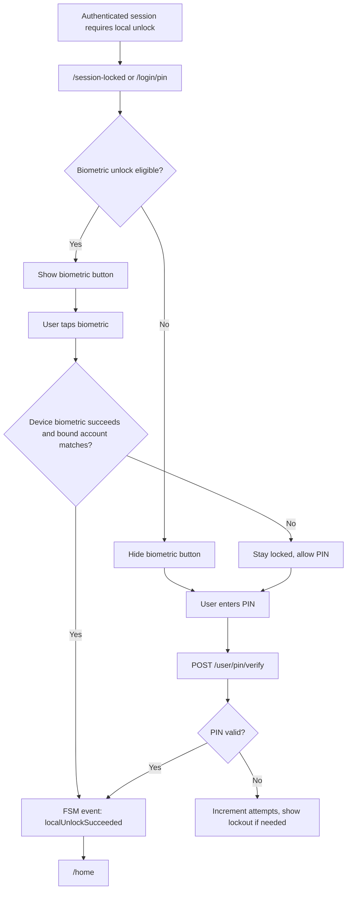

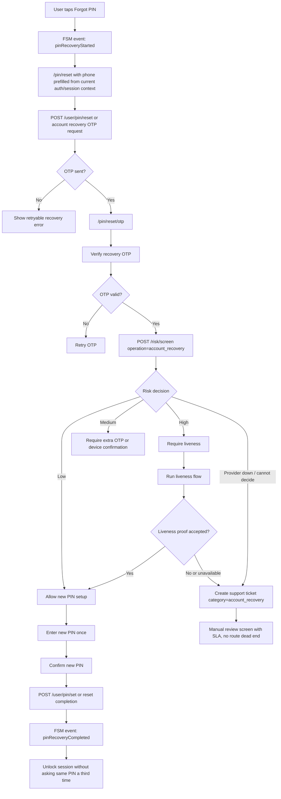

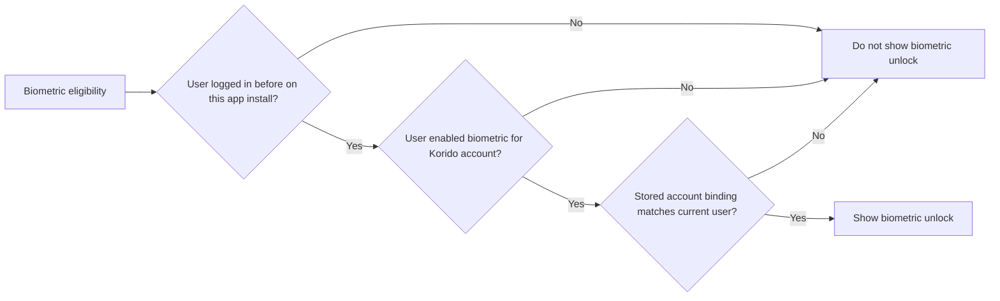

## 5. KYC And Liveness

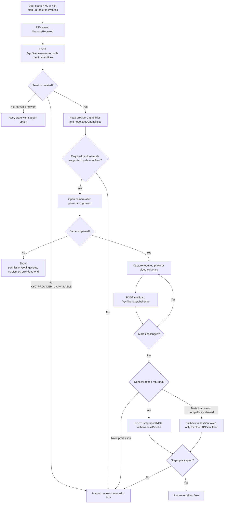

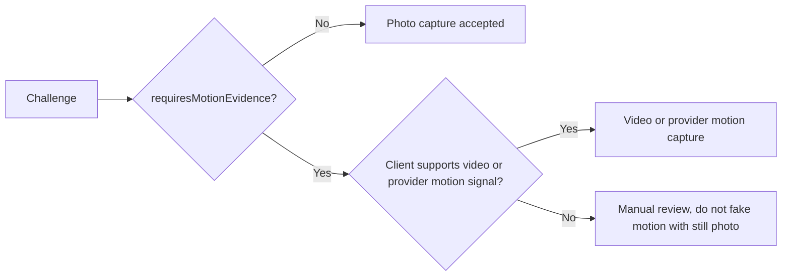

## 6. Home, Balance, And Pull To Refresh

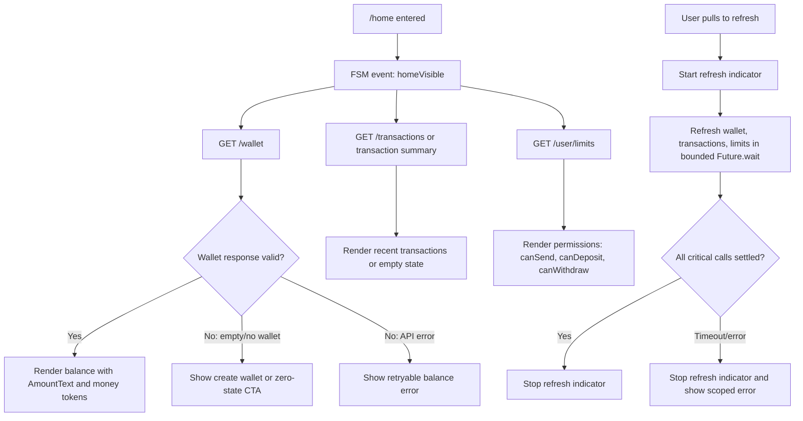

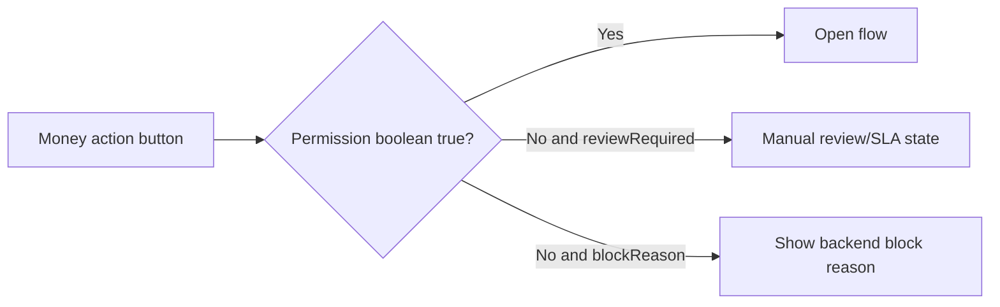

## 7. Send Money And Korido Account Identification

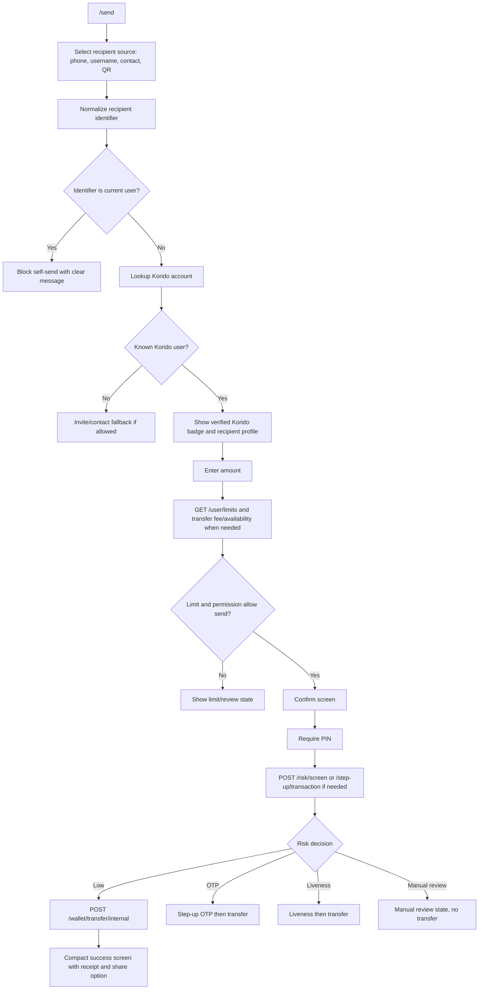

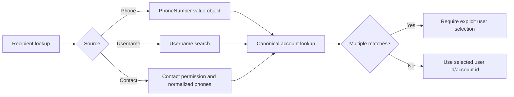

## 8. Contacts And Address Book Permissions

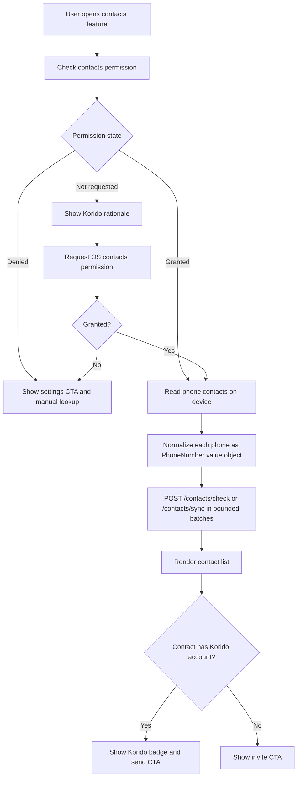

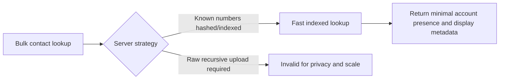

## 9. Profile Photo Update

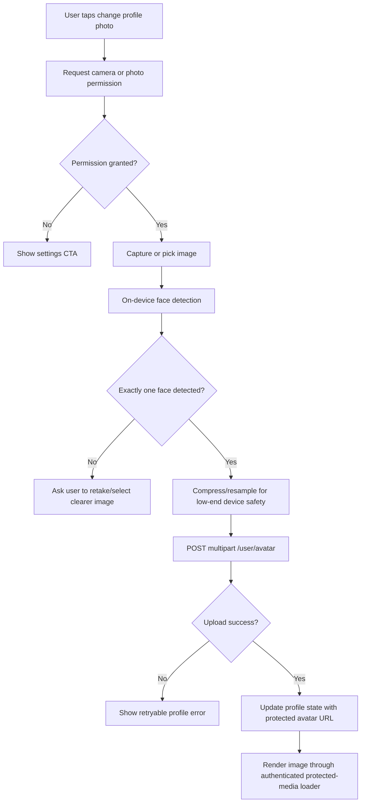

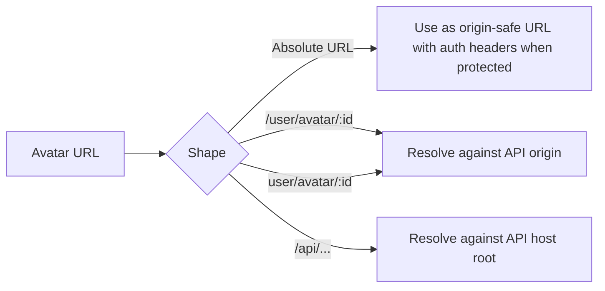

## 10. Notifications, Session Expiry, And Logout

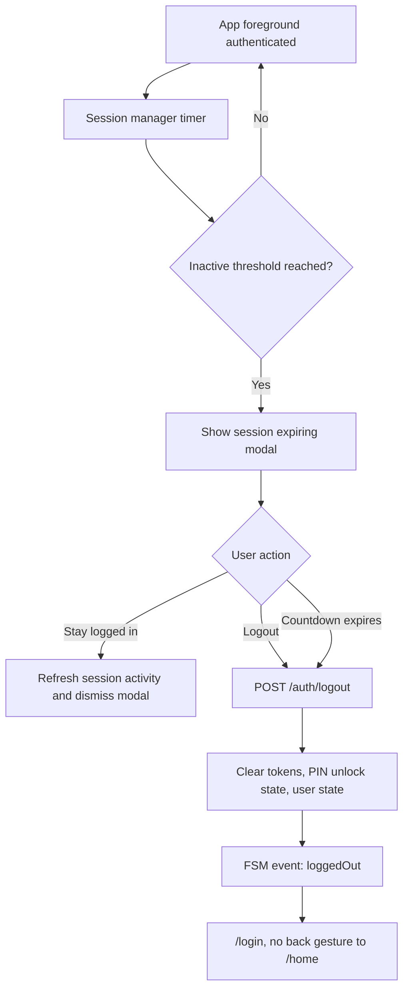

```mermaid
flowchart LR
  A["Notification"] --> B{"Severity"}
  B -- "Info/success" --> C["Neutral/dark surface, readable text"]
  B -- "Warning" --> D["Warm accent, readable text"]
  B -- "Error/security" --> E["Error surface, high contrast text"]
  C --> F["Placement does not cover primary CTA"]
  D --> F
  E --> F
```

## 11. Devices And Backoffice Blacklist

```mermaid
flowchart TD
  A["App authenticated"] --> B["Register/update device"]
  B --> C["POST /devices/register and /risk/device/register"]
  C --> D["Device appears in settings devices"]
  D --> E{"User action"}
  E -- "Trust" --> F["POST /devices/:id/trust"]
  E -- "Untrust" --> G["POST /devices/:id/untrust"]
  E -- "Revoke" --> H["DELETE /devices/:id"]
  I["Backoffice admin blacklists device"] --> J["Device status set to blacklisted"]
  J --> K["Sessions for device revoked"]
  K --> L["Next mobile API call receives security/device block"]
  L --> M["FSM event: deviceBlacklisted"]
  M --> N["Security block screen, support path only"]
```

```mermaid
flowchart LR
  A["Device access decision"] --> B{"Device blacklisted?"}
  B -- "Yes" --> C["Block app access"]
  B -- "No" --> D{"Device trusted?"}
  D -- "Yes" --> E["Lower account-recovery risk"]
  D -- "No" --> F["Higher recovery/session risk"]
```

## 12. Staging Candidate Gate

```mermaid
flowchart TD
  A["Develop slice completed"] --> B["Focused verification: analyzer/build/test/API/simulator"]
  B --> C{"Known crash or dead end?"}
  C -- "Yes" --> D["Keep on develop, fix blocker"]
  C -- "No" --> E{"Core candidate paths pass?"}
  E -- "No" --> D
  E -- "Yes" --> F["Commit and push develop"]
  F --> G{"Mobile TestFlight candidate?"}
  G -- "No" --> H["Do not push mobile staging"]
  G -- "Yes" --> I["Run candidate checklist and version/build sanity"]
  I --> J["Promote develop -> staging"]
  J --> K["Codemagic builds TestFlight"]
```

```mermaid
flowchart LR
  A["Candidate paths"] --> B["Startup/login/OTP"]
  A --> C["PIN unlock/recovery"]
  A --> D["KYC/liveness/manual review"]
  A --> E["Home balance refresh"]
  A --> F["Send money"]
  A --> G["Contacts lookup"]
  A --> H["Profile photo"]
  A --> I["Notifications/session/logout"]
  A --> J["Devices/security block"]
```
